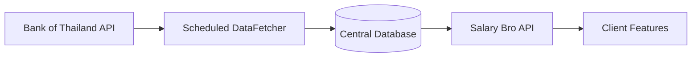

# Salary Bro OpenAPI Design

## Project overview

Salary Bro is a completed, contract-first API design assignment for four related personal-finance features. This public release contains the approved OpenAPI contract and one combined system-design document.

## Assignment scope

The assigned work covered API contract design and system-design documentation only. A production backend, frontend, deployment, and live Bank of Thailand integration were outside the assignment scope and are not included. Nothing in this repository is claimed to be deployed or running.

## Four features

1. **Exchange Rate Alert** - reads synchronized exchange-rate snapshots, manages registered-user alert rules, and exposes simulated alert notifications.
2. **Holiday Master Plan** - recommends efficient leave plans from synchronized holiday information.
3. **Financial Comparison** - compares educational deposit-return examples using synchronized financial reference data.
4. **Salary Power Calculator** - estimates salary purchasing power against synchronized market benchmarks.

## Central data synchronization architecture



The scheduled DataFetcher is an internal system component, not a public feature endpoint. It requests the required Bank of Thailand datasets, normalizes successful responses, and stores them in one central database. User-facing endpoints read that synchronized store instead of calling the external API for every request.

This design reduces repeated external API calls, provides a consistent data snapshot across features, and improves response time. Refresh frequency is configurable per dataset: a daily schedule is suitable for this assignment design, while monthly statistics or annual holiday information may refresh less frequently. Responses expose or document `dataAsOf` information; implementations may also track `fetchedAt`. If a later synchronization fails, the design may retain the last successful snapshot while clearly reporting its age. This is controlled synchronization, not real-time financial data.

## OpenAPI organization

All four features are contained in one OpenAPI specification: [openapi/salary-bro.openapi.json](openapi/salary-bro.openapi.json). They belong to one Salary Bro system and share a central application server, synchronized database, versioning, schemas, errors, and security concepts. OpenAPI tags separate the feature areas within the single contract; the approved operations and schemas have not been split into separate files.

## Endpoint summary

| Method | Path | Feature | Purpose | Mock authentication required |
|---|---|---|---|---|
| GET | `/exchange-rates/latest` | Exchange Rate Alert | Read the latest synchronized exchange-rate snapshot | No |
| GET | `/exchange-rate-alerts` | Exchange Rate Alert | List the registered user's alert rules | Yes |
| POST | `/exchange-rate-alerts` | Exchange Rate Alert | Create an alert rule | Yes |
| GET | `/exchange-rate-alerts/{alertId}` | Exchange Rate Alert | Read one alert rule | Yes |
| PATCH | `/exchange-rate-alerts/{alertId}` | Exchange Rate Alert | Update or pause an alert rule | Yes |
| DELETE | `/exchange-rate-alerts/{alertId}` | Exchange Rate Alert | Delete an alert rule | Yes |
| GET | `/notifications` | Exchange Rate Alert | List simulated alert notifications | Yes |
| PATCH | `/notifications/{notificationId}` | Exchange Rate Alert | Mark a simulated notification as read | Yes |
| POST | `/holiday-plans/recommendations` | Holiday Master Plan | Recommend efficient leave plans | No |
| POST | `/financial-comparisons` | Financial Comparison | Compare educational deposit-return examples | No |
| POST | `/salary-power-calculations` | Salary Power Calculator | Estimate salary purchasing power | No |

## Mock authentication

`X-API-Key` is a mock API-key contract only. No real credential is included. For design purposes, it represents a registered user on the protected alert and notification operations; it is not a production authentication implementation.

## How to inspect the OpenAPI file

Open [openapi/salary-bro.openapi.json](openapi/salary-bro.openapi.json) in an OpenAPI 3.0-compatible viewer or editor. The contract can also be read directly as JSON. The listed localhost server URLs are design and mock-server examples only and do not indicate a running service.

The combined diagrams are available in [docs/salary-bro-system-design.pdf](docs/salary-bro-system-design.pdf).

## Repository structure

```text
salary-bro-openapi-design/
|-- README.md
|-- NOTICE
|-- openapi/
|   `-- salary-bro.openapi.json
`-- docs/
    `-- salary-bro-system-design.pdf
```

## Privacy statement

Team-member identities are intentionally omitted. No student IDs, member names, email addresses, usernames, personal information, real user data, or real financial data are included. No Bank of Thailand credential, access token, password, connection string, or other production secret is included.

## Limitations

- No production backend is included because implementation was outside the assignment scope.
- No frontend, deployment configuration, live synchronization worker, or public manual synchronization endpoint is included.
- The Bank of Thailand integration and authentication behavior are documented design contracts, not live services.
- Financial datasets can become stale between scheduled refreshes; consumers must inspect the documented data-as-of information.
- Localhost URLs are design and mock-server examples.

## Disclaimer

This repository is not affiliated with or endorsed by the Bank of Thailand. Third-party names and data sources remain the property of their respective owners. Financial calculations are educational design examples and are not financial advice.

## Rights statement

Copyright © 2026 Salary Bro Project Team. All rights reserved. Public availability is limited to academic review and portfolio demonstration; see [NOTICE](NOTICE) for the applicable rights notice.
